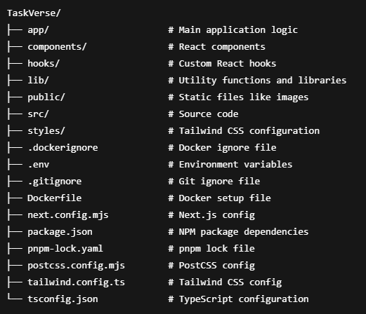

# TaskVerse

TaskVerse is a modern web application designed to help you organize your tasks and boost your productivity with a futuristic and user-friendly interface. Built with **Vercel** and **Firebase**, and using **Superbase** as the database, TaskVerse aims to make task management easy and efficient for everyone.

## Table of Contents

- [Description](#description)
- [Features](#features)
- [Technologies Used](#technologies-used)
- [Setup Instructions](#setup-instructions)
  - [Local Setup](#local-setup)
  - [Docker Setup](#docker-setup)
- [Environment Variables](#environment-variables)
- [Project Structure](#project-structure)
- [Contributing](#contributing)

## Description

TaskVerse is designed to improve your productivity by helping you track, organize, and manage tasks effectively. With its modern interface and real-time database integration, TaskVerse ensures that you stay on top of your tasks with minimal effort.

## Features

- Task creation and management
- Real-time syncing with Superbase database
- User authentication and session management via Firebase
- Modern and clean UI
- Mobile and desktop responsiveness
- Docker compatibility for easy deployment

## Technologies Used

- **Frontend:** React, Next.js
- **Backend:** Firebase, Superbase
- **Styling:** Tailwind CSS
- **Deployment:** Vercel
- **Containerization:** Docker

## Setup Instructions

### Local Setup

To run **TaskVerse** locally, follow these steps:

1. Clone this repository:

   ```bash
   git clone https://github.com/yourusername/TaskVerse.git
   cd TaskVerse
# TaskVerse

TaskVerse is a modern web application designed to help you organize your tasks and boost your productivity with a futuristic and user-friendly interface. Built with **Vercel** and **Firebase**, and using **Superbase** as the database, TaskVerse aims to make task management easy and efficient for everyone.

## Table of Contents

- [Description](#description)
- [Features](#features)
- [Technologies Used](#technologies-used)
- [Setup Instructions](#setup-instructions)
  - [Local Setup](#local-setup)
  - [Docker Setup](#docker-setup)
- [Environment Variables](#environment-variables)
- [Project Structure](#project-structure)
- [Contributing](#contributing)
- [License](#license)

## Description

TaskVerse is designed to improve your productivity by helping you track, organize, and manage tasks effectively. With its modern interface and real-time database integration, TaskVerse ensures that you stay on top of your tasks with minimal effort.

## Features

- Task creation and management
- Real-time syncing with Superbase database
- User authentication and session management via Firebase
- Modern and clean UI
- Mobile and desktop responsiveness
- Docker compatibility for easy deployment

## Technologies Used

- **Frontend:** React, Next.js
- **Backend:** Firebase, Superbase
- **Styling:** Tailwind CSS
- **Deployment:** Vercel
- **Containerization:** Docker

## Setup Instructions

### Local Setup

To run **TaskVerse** locally, follow these steps:

1. Clone this repository:

   ```bash
   git clone https://github.com/yourusername/TaskVerse.git
   cd TaskVerse
   ```
   
2. Install dependencies using pnpm:

   ```bash
   pnpm install
   ```

3. Create a .env file based on the .env.example file and provide your Superbase API URL and Key. Example:

   ```bash
   SUPERBASE_URL=your_superbase_url
   SUPERBASE_KEY=your_superbase_key
   ```

4. Start the development server:

   ```bash
   pnpm run dev
   ```
   
5. Your app should now be running at http://localhost:3000.
   
### Docker Setup

To dockerize TaskVerse:

1. Ensure you have Docker installed on your machine.

2. Create your .env file with the Superbase API URL and Key (same as the local setup).

3. In the Dockerfile, ensure you replace SUPERBASE_URL and SUPERBASE_KEY with the correct environment variables.

   ```bash
   ENV SUPERBASE_URL=your_superbase_url
   ENV SUPERBASE_KEY=your_superbase_key
   ```
   
4. Build the Docker image:

   ```bash
   docker build -t taskverse .
   ```
   
5. Run the container:

   ```bash
   docker run -p 3000:3000 taskverse
   ```

6. Your app should now be running at http://localhost:3000 within the Docker container.

## Environment Variables

Make sure to configure the following environment variables in your .env file:

 - NEXT_PUBLIC_SUPABASE_URL - Your Superbase API URL

 - NEXT_PUBLIC_SUPABASE_ANON_KEY - Your Superbase API Key

 - SUPERBASE_URL - Your Superbase API URL

 - SUPERBASE_KEY - Your Superbase API Key

These variables should also be set in the Dockerfile for containerized deployments.

## Project Structure

Here is the directory structure of TaskVerse:




## Contributing

Contributions are always welcome! If you'd like to contribute, feel free to fork the repository and submit a pull request. Please ensure your code follows the project's code style and includes tests where applicable.


